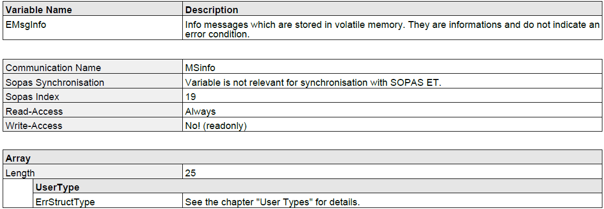
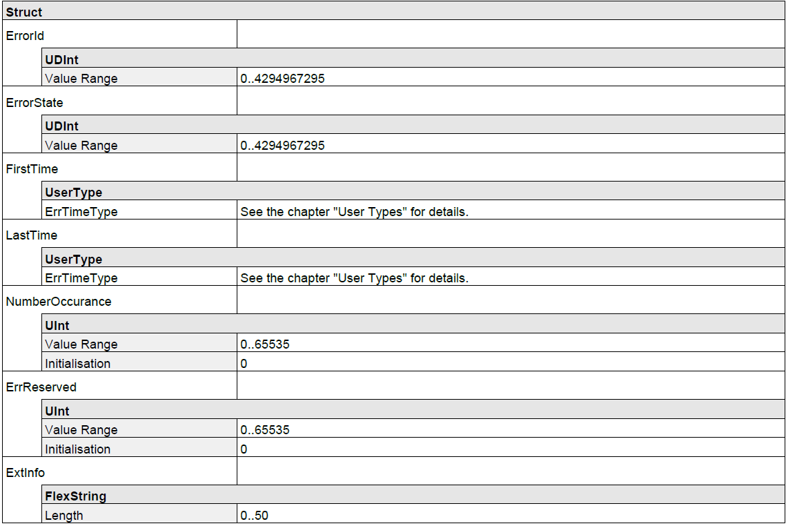
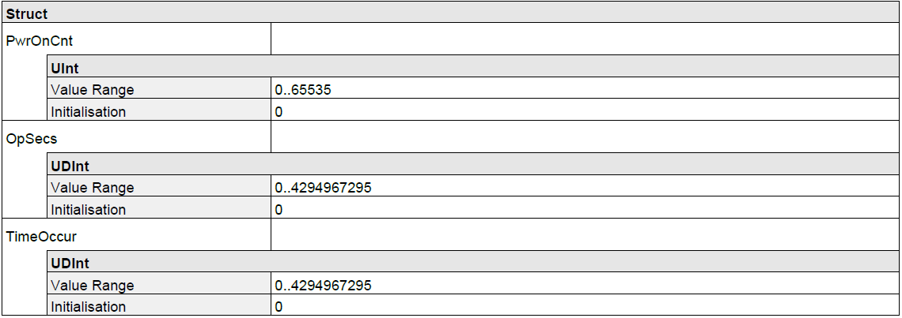
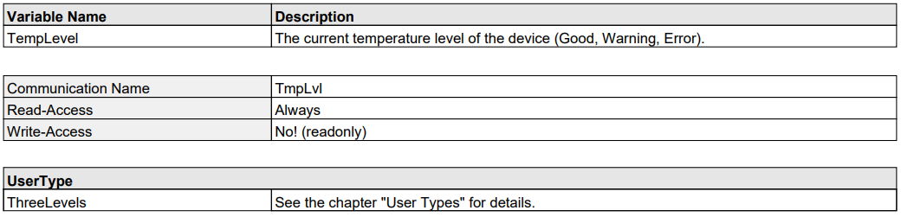
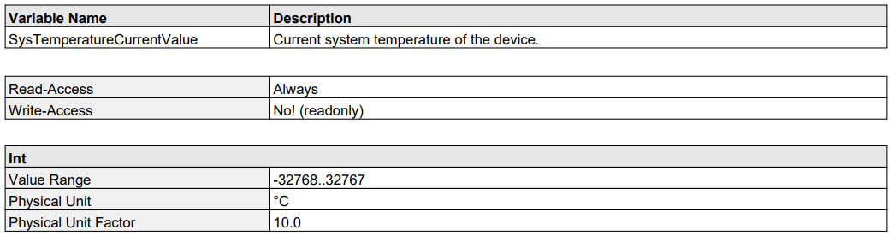
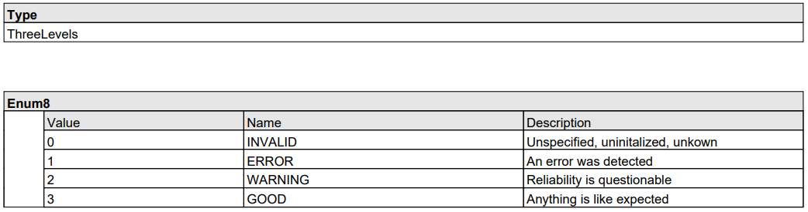

= Diagnosing Visionary devices
:toclevels: 4
:source-highlighter: rouge
:icons: font
:toc:

This README gives an introduction to the C++ and Python code examples in this folder on the subject of Visionary camera diagnostics.
Visionary devices provide a variety of variables for monitoring system health and status. Diagnostic messages combine all diagnostic logging statements, making them readily accessible for review and analysis. How to read the system log is explained in <<System log>>.

In addition to the diagnostic messages in the system log, there are specific variables that provide insights into sepcific aspects of the system. These include:

* System Temperature
* Operating Voltage
* Humidity
* Additional Parameters

These variables play a crucial role in maintaining the optimal performance and longevity of the system by allowing users to monitor and address any potential issues promptly.
How to read these variables and diagnose the system is shown in <<Device Status>>.

== How to run the samples

[NOTE]
====
Remember to adjust the command line arguments like IP address (`-i`) and device type (`-d`) to match your specific device.
====

**C++**

:relfileprefix: ../
Either build and run the samples from the top level directory as described in xref:README.adoc#getting-started[Getting Started] or build and run the samples from the sample subdirectory using its CmakeLists.txt file.

**System log**
[source,bash]
----
cd build/
./system_log -i192.168.1.10 -dVisionary-S
----

**Diagnosing devices**
[source,bash]
----
cd build/
./device_state -i192.168.1.10 -dVisionary-S
----

**Python**

[NOTE]
====
Make sure you followed the prerequisite steps in xref:README.adoc#getting-started[Getting Started]
====

To run the Python samples, execute the following command from the **top-level directory**:

**System log**
[source,bash]
----
python3 -m diagnosing_devices.python.system_log -i192.168.1.10 -dVisionary-S
----

**Diagnosing devices**
[source,bash]
----
python3 -m diagnosing_devices.python.device_state -i192.168.1.10 -dVisionary-S
----

**Diagnosing devices extended**
[source,bash]
----
python3 -m diagnosing_devices.python.device_state_extended -i192.168.1.10 -dVisionary-S
----

== System log

Visionary devices offer a range of variables for diagnostic messages in the system log, each corresponding to a different level of severity:

* `EMsgInfo`: For informational messages
* `EMsgWarning`: For warning messages
* `EMsgError`: For error messages
* `EMsgFatal`: For critical error messages

This example shows how to read the variable `EMsgInfo` which contains all info log messages in the device. The first step is to look up the variable definition, this is the *Variable Overview*:

There are a few important things to note here:

- The *Communication Name* does not match the variable name.
- The *Write-Access* is *No!* which means the variable can not be written.
- The data is an `Array` of `ErrStructType` elements.
- The array always contains 25 items.

=== Step 1: Establish a connection

The first step is to create a camera control object specifing the right `VisionaryType`. 
The `VisionaryControl` class provides an interface for controlling a Visionary Camera, including managing the connection, logging in and out, and controlling data acquisition.

**C++**
[source,c++]
----
using namespace visionary;

  // Generate Visionary instance
  VisionaryControl visionaryControl(visionaryType);

  // Connect to devices control channel
  if (!visionaryControl.open(ipAddress))
  {
    std::printf("Failed to open control connection to device.\n");
    return ExitCode::eCommunicationError;
  }
   
----
**Python**
[source, python]
----
# Create a Control object for the device
    deviceControl = Control(ip_address, cola_protocol, control_port)
    # Open a connection to the device
    deviceControl.open()
     
----

=== Step 2: Build and send the read command

Once a connection to the device has been successfully established we construct a read command and send it to the device, notice that the *Communication Name* is used and not the variable name. The built command is then sent to the device using the `sendCommand()` function of the visionaryControl object. The response from the device, which contains the information messages, is stored in the messagesResponse variable.

**C++**
[source,c++]
----
// Read info messages variable
  CoLaCommand getMessagesCommand = CoLaParameterWriter(CoLaCommandType::READ_VARIABLE, "MSinfo").build();
  CoLaCommand messagesResponse   = visionaryControl.sendCommand(getMessagesCommand);
  if (messagesResponse.getError() != CoLaError::OK)
  {
    std::printf("Failed to read variable MSinfo\n");
    return ExitCode::eParamError;
  }
   
----

**Python**
[source, python]
----
# get the device message log
    msgLog = deviceControl.getMessageLog("MSinfo")
     
----

=== Step 3: Parse and print the system log response 

The next step is to parse the response. For this it is required to lookup the `ErrStructType` definition in the xref:HOW_TO_COLA_COMMANDS.adoc#_cola_telegram_listing[telegram listing] document, which looks like this:

As seen above this struct contains seven different values with different types. Also notice that the `FirstTime` and `LastTime` members are of type `ErrTimeType`, this struct can also be found in the document:

Together with the knowledge that the array always contains 25 items of ErrStructType and each ErrStructType contains ErrorId, ErrorState, …​ it is now possible to parse the response command using a `CoLaParameterReader`:

**C++**
[source,c++]
----
// Read message array, length of array is always 25 items (see MSinfo in PDF).
  CoLaParameterReader reader(messagesResponse);
  for (int i = 0; i < 25; i++) // Read 25 items
  {
    std::uint32_t errorId    = reader.readUDInt();
    std::uint32_t errorState = reader.readUDInt();

    // Read ErrTimeType struct members for FirstTime
    std::uint16_t firstTime_PwrOnCount = reader.readUInt();
    std::uint32_t firstTime_OpSecs     = reader.readUDInt();
    std::uint32_t firstTime_TimeOccur  = reader.readUDInt();

    // Read ErrTimeType struct members for LastTime
    std::uint16_t lastTime_PwrOnCount = reader.readUInt();
    std::uint32_t lastTime_OpSecs     = reader.readUDInt();
    std::uint32_t lastTime_TimeOccur  = reader.readUDInt();

    std::uint16_t numberOccurrences = reader.readUInt();
    std::uint16_t errReserved       = reader.readUInt();
    std::string   extInfo           = reader.readFlexString();

    // Write all non-empty info messages to the console
    if (errorId != 0)
    {
      std::string errorDescription = decodeErrorCode(errorId, visionaryType.toString());
                  errorId,
                  extInfo.c_str(),
                  errorDescription.c_str(),
                  numberOccurrences);
    }
  }
   
----
**Python**
[source,python]
----
# print the message log
    for error in msgLog:
        print(f"ErrorId: {error['ErrorId']}")
        print(f"ErrorState: {error['ErrorState']}")
        print(f"FirstTime_PwrOnCnt: {error['FirstTime_PwrOnCnt']}")
        print(f"FirstTime_OpSecs: {error['FirstTime_OpSecs']}")
        print(f"FirstTime_TimeOccur: {error['FirstTime_TimeOccur']}")
        print(f"LastTime_PwrOnCnt: {error['LastTime_PwrOnCnt']}")
        print(f"LastTime_OpSecs: {error['LastTime_OpSecs']}")
        print(f"LastTime_TimeOccur: {error['LastTime_TimeOccur']}")
        print(f"NumberOccurance: {error['NumberOccurance']}")
        print(f"ErrReserved: {error['ErrReserved']}")
        print(f"ExtInfo: {error['ExtInfo'].decode('utf-8')}")
        print("\n")
     
----

NOTE: It is important to read the values in the same order as they appear in the table! +
      Use `reader.rewind();` to read from the beginning of a command again.

=== Final step: Disconnect
Finally we disconnect from the control channel.

**C++**
[source, c++]
----
visionaryControl.close();
   
----
**Python**
[source,python]
----
# Close the connection to the device
    deviceControl.close()
     
----

== Device Status

Visionary devices provide several interfaces to diagnose the current system health. You find an extensive list of variables in 
the xref:HOW_TO_COLA_COMMANDS.adoc#_cola_telegram_listing[telegram listings].
The example shows you how to read system health variables based on the three variables:

* Temperature Level
* SystemTemperature 
* Operating Voltage

The first step is to look up the variable definition, this is the Variable Overview:

image:images/opvol.PNG[]

There are a few important things to note here:

- The *Communication Name* does not always match the variable name.
- The *Write-Access* is *No!* which means the variable can not be written.
- The data is of *UserType* `ThreeLevels` for the variables `TempLevel` and `OpVoltageStatus`
- UserType ThreeLevels is an enum with 4 distinct values

=== Step 1 and 2:
As in the example above first you need to establish a connection to the device. Then you'll be able to build and send the cola command.

Follow <<Step 1: Establish a connection>> 
and <<Step 2: Build and send the read command>>. Make sure to adjust the variable names. 

**C++**
[source, c++]
----
// Read Temperature Level
  CoLaCommand getTempLvl         = CoLaParameterWriter(CoLaCommandType::READ_VARIABLE, "TmpLvl").build();
  CoLaCommand getTempLvlResponse = visionaryControl.sendCommand(getTempLvl);
   
----

[source, c++]
----
// Read operating voltage status
  CoLaCommand getOpVol      = CoLaParameterWriter(CoLaCommandType::READ_VARIABLE, "OpVoltageStatus").build();
  CoLaCommand opVolResponse = visionaryControl.sendCommand(getOpVol);
   
----

**Python**
[source, python]
----
# Read temperature level
    tmp_lvl_response = device_control.readVariable(b'TmpLvl')
     
----

[source, python]
----
# Read operating voltage status
    op_voltage_status_response = device_control.readVariable(
        b'OpVoltageStatus')
     
----

=== Step 3: Read the response (UserType ThreeLevels)

The return type of `TmpLvl` as well as `OpVoltageStatus` is an int enum of user type `ThreeLevels`. It has four distinct levels:

*  INVALID = 0,
*  ERROR   = 1,
*  WARNING = 2,
*  GOOD    = 3

The usertype `Threelevels` has a class definition in the file `usertypes.h`. This should simplfy reading and interpreting the values.

NOTE: Different usertypes are defined in `usertypes.h` and `Usertypes.py`. If you're in need of a usertype which currently has no implementation, feel free to contribute to these repos.

[source, c++]
----
if (getTempLvlResponse.getError() != CoLaError::OK)
  {
    std::printf("Failed to read Temperature Level\n");
    return ExitCode::eParamError;
  }
  else
  {
    // returns Int enum of type ThreeLevels
    std::uint8_t           tmpLvlEnum = CoLaParameterReader(getTempLvlResponse).readUSInt();
    UserTypes::ThreeLevels tmpLvl     = UserTypes::ThreeLevels(tmpLvlEnum);
    std::printf("Read Temperature Level = %s\n", tmpLvl.to_string().c_str());
  }
   
----
[source, c++]
----
if (opVolResponse.getError() != CoLaError::OK)
  {
    std::printf("Failed to read Operating Voltage Status\n");
    return ExitCode::eParamError;
  }
  else
  {
    // returns Int enum of type ThreeLevels
    std::uint8_t           opVolEnum   = CoLaParameterReader(opVolResponse).readUSInt();
    UserTypes::ThreeLevels opVolStatus = UserTypes::ThreeLevels(opVolEnum);
    std::printf("Read Operating voltage status = %s\n", opVolStatus.to_string().c_str());
  }
   
----

**Python**
[source, python]
----
tmp_lvl_enum = struct.unpack('>B', tmp_lvl_response)[0]
    tmp_lvl = ThreeLevels(tmp_lvl_enum)
    print(f"Read Temperature Level: {tmp_lvl.name}")
     
----
[source, python]
----
op_voltage_status_enum = struct.unpack('>B', op_voltage_status_response)[0]
    op_voltage_status = ThreeLevels(op_voltage_status_enum)
    print(f"Read operating voltage status: {op_voltage_status.name}")
     
----

=== Final step: Disconnect
Finally we disconnect from the control channel.
See <<Final step: Disconnect>>