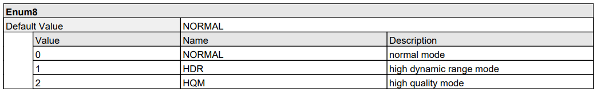
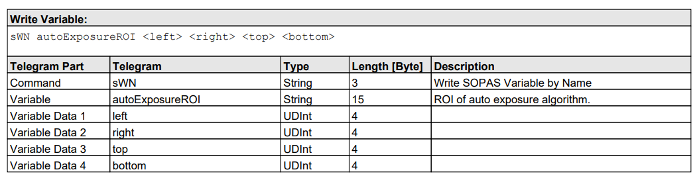
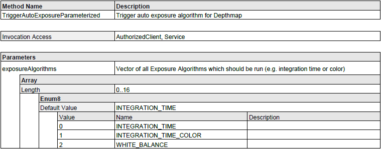
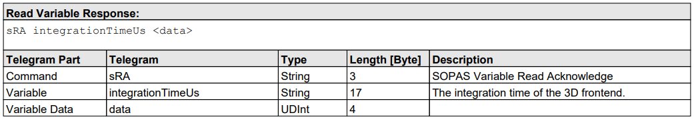
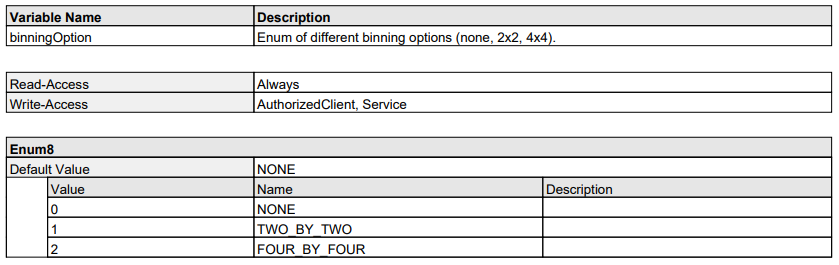
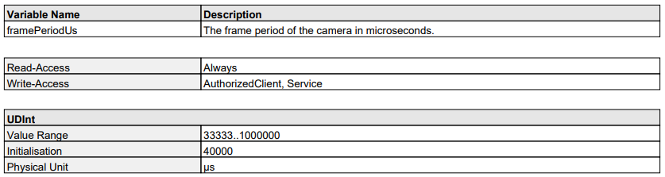
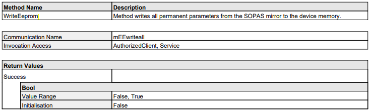
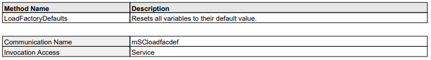

:toc:

= Visionary devices frontend configuration

This README gives an introduction to the C++ and Python code examples in this folder on how to configure the frontend of a Visionary camera. Last but not least, it is shown how to permanently save a configuration on a device and how to restore the (default) configuration.
Visionary camera devices offer the capability to configure and optimize the frontend settings for you application. These settings can be broadly classified into two categories:

.General Settings
- Camera Controls
- Mounting Settings

.Device Specific Settings
- Filter Settings
- Time Synchronisation
- ...

The standard procedure to modify these frontend settings involves the exchange of CoLa commands with the device. Whether it's reading or writing variables, or invoking a device method, the process generally follows these steps:

. Create a CoLa command.
. Dispatch the created command to the device.
. Await the response command from the device.
. Analyze the received response command.

A CoLa command is made up of a `type`, a `name`, and any number of parameters. The name and the parameters that have to be used for a specific command is specified in the respective xref:HOW_TO_COLA_COMMANDS.adoc#_cola_telegram_listing[telegram listing] for the device.

The following sections demonstrate how to configure the frontend settings of Visionary-S CX (see <<Visionary-S specific frontend configuration>>) and the Visionary-T Mini CX
(see <<Visionary-T Mini specific frontend configuration>>). 

== How to run the samples

[NOTE]
====
Remember to adjust the command line arguments like IP address (`-i`) and device type (`-d`) to match your specific device.
====

**C++**

:relfileprefix: ../
Either build and run the samples from the top level directory as described in xref:README.adoc#getting-started[Getting Started] or build and run the samples from the sample subdirectory using its CmakeLists.txt file.

**Visionary-S frontend configuration**
[source,bash]
----
cd build/
./visionary_s_frontend_config -i192.168.1.10
----

**Visionary-T Mini frontend configuration**
[source,bash]
----
cd build/
./visionary_t_mini_frontend_config -i192.168.1.10
----

**Save permanently**
[source,bash]
----
cd build/
./save_permanently -i192.168.1.10 -dVisionary-S
----

**Python**

[NOTE]
====
Make sure you followed the prerequisite steps in xref:README.adoc#getting-started[Getting Started]
====

To run the Python samples, execute the following command from the **top-level directory**:

**Visionary-S frontend configuration**
[source,bash]
----
python3 -m image_frontend_configuration.python.visionary_s_frontend_config -i192.168.1.10
----

**Visionary-T Mini frontend configuration**
[source,bash]
----
python3 -m image_frontend_configuration.python.visionary_t_mini_frontend_config -i192.168.1.10
----

**Save permanently**
[source,bash]
----
python3 -m image_frontend_configuration.python.save_permanently -i192.168.1.10 -dVisionary-S
----

== Visionary-S specific frontend configuration

The Visionary-S CX device offers a number of different interfaces to configure the frontend settings. Frontend settings can generally be divided into four main categories:

* **Camera controls**: frontendMode, SingleStep, ...
* **Mounting settings**: sensorPosition, sensorOrientation, ...
* **Stereo settings**: acquisitionModeStereo, integrationTimeUs, ...
* **Filter settings**: enCartFilter, cartFilterBounds, ...

This example demonstrates: 

. How to set the **acquisition mode**.
. How to set the **region of interest** (ROI).
. How to use the **auto exposure** functions and how it effects the integration time.
. How to read and set the **integration time**.

=== 1. Connect to the device and login

The first step is to create a camera control object specifing the right VisionaryType. The VisionaryControl class provides an interface for controlling a Visionary Camera, including managing the connection, logging in and out, and controlling data acquisition.

IMPORTANT: Before configuring any frontend settings, a connection to the device's control channel must be established, and the user must be logged in with the required user level. 

**C++**
[source, c++]
----
using namespace visionary;

  VisionaryControl visionaryControl(visionaryType);
  if (!visionaryControl.open(ipAddress))
  {
    std::printf("Failed to open control connection to device.\n");
    return ExitCode::eCommunicationError;
  }
  if (!visionaryControl.login(IAuthentication::UserLevel::AUTHORIZED_CLIENT, "CLIENT"))
  {
    std::printf("Failed to log into the device.\n");
    return ExitCode::eAuthenticationError;
  }
  
----

**Python**
[source, python]
----
device_control = Control(ip_address, cola_protocol, control_port)
    device_control.open()
    device_control.login(Control.USERLEVEL_AUTH_CLIENT, "CLIENT")
    
----

=== 2. Set the acquisition mode

The acquisition mode of the stereo frontend offers three modes:

* *Normal*: This is the standard acquisition mode, suitable for most scenarios.
* *HDR (High Dynamic Range)*: This mode is ideal when the scene contains both dark and shiny objects. It allows the user to define two different integration times, effectively handling scenes with a high dynamic range.
* *HQM (High Quality Mode)*: This mode enhances the repeatability of depth values at the cost of a potentially slightly reduced frame rate.

Each mode is designed to optimize the stereo frontend's performance under different conditions. The choice of mode depends on the specific requirements of the scene being captured and the application.

IMPORTANT:  Please note that the variable name for the integration time may change depending on the acquisition mode selected.

Looking at the variable overview for `acquisitionModeStereo` we notice a few things:

- *Write-Access* is granted for *AuthorizedClient, Service*
- The data is of type `Enum8` with three predefined values

To configure the acquisition mode we simply specify the right int value according from the table, build and send the command.

**C++**
[source, c++]
----
std::uint8_t acquisitionModeStereo = 0; // 0 = NORMAL
  CoLaCommand  setAcquisitionModeStereoCommand =
    CoLaParameterWriter(CoLaCommandType::WRITE_VARIABLE, "acquisitionModeStereo")
      .parameterUSInt(acquisitionModeStereo)
      .build();
  CoLaCommand setAcquisitionModeStereoResponse = visionaryControl.sendCommand(setAcquisitionModeStereoCommand);
  
----

**Python**
[source, python]
----
new_acquisition_mode_stereo = AcquisitionModeStereo.NORMAL
    device_control.setAcquisitionModeStereo(new_acquisition_mode_stereo.value)

    get_acquisition_mode_stereo = device_control.getAcquisitionModeStereo()
    acquisition_mode_stereo = AcquisitionModeStereo(
        get_acquisition_mode_stereo)
    print(f"\nRead AcquisitionModeStereo: {acquisition_mode_stereo.name}")
    
----

=== 3. Configure a ROI (Region of interest)

NOTE: The example uses AcquisitionModeStereo = NORMAL

The Visionary-S CX device has different settings that allow or require to define a ROI for the used algorithm, namely:

* `autoExposureROI`
* `autoExposureHDRROI`
* `autoExposureColorROI`
* `autoWhiteBalanceROI`

Looking at the variable overview for `autoExposureROI` we notice a few things:

- The *Write-Access* is for *AuthorizedClient, Service*
- The data is a `Struct` of four elements.
- The four elements are of type UDInt.
 

To configure the Region of Interest (ROI), we need to follow these steps:

Define the four elements:

. left, right, top, and bottom.
. Sequentially add these elements to the CoLa command. This is achieved by invoking the `parameterUDInt` method for each element.
. build and send the command.

**C++**
[source, c++]
----
std::uint32_t left   = 160;
  std::uint32_t right  = 480;
  std::uint32_t top    = 128;
  std::uint32_t bottom = 384;

  // Set ROI for Auto Exposure 3D
  CoLaCommand setAutoExposureROICommand = CoLaParameterWriter(CoLaCommandType::WRITE_VARIABLE, "autoExposureROI")
                                            .parameterUDInt(left)
                                            .parameterUDInt(right)
                                            .parameterUDInt(top)
                                            .parameterUDInt(bottom)
                                            .build();
  CoLaCommand setAutoExposureROIResponse = visionaryControl.sendCommand(setAutoExposureROICommand);
  
----

**Python**
[source, python]
----
left = 160
    right = 480
    top = 128
    bottom = 384
    device_control.setAutoExposure3DROI(left, right, top, bottom)
    device_control.setAutoExposureColorROI(left, right, top, bottom)
    # NOTE: The user is responisble to make sure that the region he sets the ROI to, is actually white.
    device_control.setAutoWhiteBalanceROI(left, right, top, bottom)
    
----

=== 4. Method invokation: auto exposure parameterized

The Visionary-S CX provides several auto exposure algorithms to optimize image capture:

* `Auto Exposure 3D`
* `Auto Exposure RGB`
* `Auto White Balance`

These algorithms can be invoked in a parameterized manner using the `TriggerAutoExposureParameterized` method. This allows for flexible and precise control over the image acquisition process.

Looking at the method overview for `TriggerAutoExposureParameterized` we notice a few things:

- *Invocation-Access* is granted for *AuthorizedClient, Service*
- The method takes two parameters: 
    . The first is of type `UInt` and specifies the array length
    . The second is of type `USInt` and specifies the int-enum value for the auto exposure algorithm (see table below)

To demonstrate how the method can be used we:

. create a for loop with three iterations
. each iteration we change the auto exposure parameter
. build the CoLa command by first specifying the parameter length and then adding a second parameter for the actual auto exposure algorithm 
. send the CoLa command for the method invocation

Additionally we read the variable `integrationTimeUs` **before and after** the method invocation to show how the auto exposure algorithm effects the integration time.

**C++**
[source, c++]
----
for (uint8_t autoType = 0; autoType < 3;
       autoType++) // 0 = Auto Exposure 3D, 1 = Auto Exposure RGB, 2 = Auto White Balance
  {
    std::printf("Invoke method 'TriggerAutoExposureParameterized' (Param: %d) ...\n", autoType);

    CoLaCommand invokeAutoExposureCommand =
      CoLaParameterWriter(CoLaCommandType::METHOD_INVOCATION, "TriggerAutoExposureParameterized")
        .parameterUInt(1)
        .parameterUSInt(autoType)
        .build();
    CoLaCommand autoExposureResponse = visionaryControl.sendCommand(invokeAutoExposureCommand);

    if (autoExposureResponse.getError() != CoLaError::OK)
    {
      std::printf("ERROR: Invoking 'TriggerAutoExposureParameterized' fails! (autoExposureResponse: %d)\n",
                  CoLaParameterReader(autoExposureResponse).readBool());
    }

    // Wait until auto exposure method is finished
    bool      autoExpParamRunning = true;
    long long startTime           = std::chrono::system_clock::now().time_since_epoch().count();
    long long timeNow             = startTime;
    while (autoExpParamRunning)
    {
      CoLaCommand getAutoExpParamRunningCommand =
        CoLaParameterWriter(CoLaCommandType::READ_VARIABLE, "autoExposureParameterizedRunning").build();
      CoLaCommand autoExpParamRunningResponse = visionaryControl.sendCommand(getAutoExpParamRunningCommand);
      autoExpParamRunning                     = CoLaParameterReader(autoExpParamRunningResponse).readBool();

      timeNow = std::chrono::system_clock::now().time_since_epoch().count();
      if ((timeNow - startTime)
          <= 10000000000) // 10 sec = 10 000 000 000 ns (time after auto exposure method should be finished)
      {
        std::this_thread::sleep_for(std::chrono::seconds(1));
      }
      else
      {
        std::printf("TIMEOUT: auto exposure function (Param: %d) needs longer than expected!\n", autoType);
      }
    }
  }
  
----

**Python**
[source, python]
----
for i in range(3):
        auto_type = i
        auto_exposure_response = device_control.startAutoExposureParameterized(
            struct.pack(">HB", 1, auto_type))
        if not auto_exposure_response:
            print(
                f"ERROR: Invoking 'TriggerAutoExposureParameterized' fails! (autoExposureResponse: {auto_exposure_response}")
        # Wait until auto exposure method is finished
        auto_exp_param_running = True
        start_time = time.time()
        time_now = start_time
        while auto_exp_param_running:
            auto_exp_param_running = device_control.getAutoExposureParameterizedRunning()
            time_now = time.time()
            # 10 sec (time after auto exposure method should be finished)
            if (time_now - start_time) <= 10:
                time.sleep(1)
            else:
                print(
                    f"TIMEOUT: auto exposure function (Param: {auto_type}) needs longer than expected!")

    
----

=== 5. Read and set Integration Time

The Visionary-S CX distinguishes between four different integration times:

* `Integration Time`
* `Integration Time HDR`
* `Integration Time HQM`
* `Integration Time COLOR STEREO`

Please refer to the documentation for comprehensive explanations of each variable.

Looking at the variable overview for `integrationTimeUs` we notice a few things:

- *Write-Access* is granted for *AuthorizedClient, Service*
- The datatype is `UDInt`
- The value range is between *1 and 9300*

To configure the integration time we:

. choose a new value between 1 and 9300
. build the CoLa command by invoking the `parameterUDInt` and `build` methods with the defined value
. send the command

**C++**
[source, c++]
----
std::uint32_t newIntegrationTimeUs = 2000;
  std::printf("Setting Integration time to %d\n", newIntegrationTimeUs);
  CoLaCommand setIntegrationTimeUsCommand = CoLaParameterWriter(CoLaCommandType::WRITE_VARIABLE, "integrationTimeUs")
                                              .parameterUDInt(newIntegrationTimeUs)
                                              .build();
  CoLaCommand setIntegrationTimeUsResponse = visionaryControl.sendCommand(setIntegrationTimeUsCommand);
  
----

**Python**
[source, python]
----
device_control.setIntegrationTimeUs(3000)
    integration_time = device_control.getIntegrationTimeUs()
    print(f"Set IntegrationTimeUS: {integration_time}")
    
----

To read the new integration time we:

. build the CoLa command specifing the command type `READ_VARIABLE` and the variable name `integrationTimeUs`
. build and send the command
. parse the response

**C++**
[source, c++]
----
CoLaCommand getIntegrationTimeUsCommand =
      CoLaParameterWriter(CoLaCommandType::READ_VARIABLE, "integrationTimeUs").build();
    getIntegrationTimeUsResponse = visionaryControl.sendCommand(getIntegrationTimeUsCommand);
    integrationTimeUs            = CoLaParameterReader(getIntegrationTimeUsResponse).readUDInt();
    std::printf("Read new integrationTimeUs = %d\n", integrationTimeUs);
    
----

**Python**
[source, python]
----
integration_time = device_control.getIntegrationTimeUs()
    print(f"Read IntegrationTimeUS: {integration_time}")
    
----

=== Final step: Logout and disconnect

Finally we logout from the device and disconnect the control connection.

**C++**
[source, c++]
----
if (!visionaryControl.logout())
  {
    std::printf("Failed to logout\n");
    return ExitCode::eAuthenticationError;
  }
  
----

**Python**
[source, python]
----
device_control.logout()
    device_control.close()
    
----

== Visionary-T Mini specific frontend configuration

The Visionary-T Mini CX device offers a number of different interfaces to configure the frontend settings. Frontend settings can generally be divided into four main categories:

* **Camera controls**: frontendMode, SingleStep, ...
* **Mounting settings**: sensorPosition, sensorOrientation, ...
* **Filter settings**: enDepthMask, enableDistanceFilter, ...
* **Time synchronisation**: timeSynchronizationEnabled, ...

This example demonstrates: 

. How to configure the Binning Option.
. How to read and set the Frame Period.

=== 1. Connect and login 

IMPORTANT: Before configuring any device settings, ensure to complete <<1. Connect to the device and login>>. Typically, modifying device variables necessitates a login with the appropriate user level.

=== 2. Configure the Binning Option

Use `BinningOption` to combine a cluster of adjacent pixels on the cameras' imager.
Pixel binning improves the robustness of the data and increases the repeatability of the measurement values.
The selected binning option reduces the image resolution by the respective factor and thus reduces the bandwidth usage.

* `Off` disables pixel binning.
* `2x2` combines four image pixels into
one.
* `4x4` combines 16 image pixels into one.

NOTE: The possible binning options depend on the defined region of interest (ROI). The ROI width must be divisible by eight for 2x2 and by 16 for 4x4.
The ROI height must be divisible by two for 2x2 and by four for 4x4.

Looking at the variable overview for `binningOption` we notice a few things:

- The *Write-Access* is for *AuthorizedClient, Service*
- The datatype is `Eum8` with three predefined values
    * 0 = NONE
    * 1 = TWO_BY_TWO
    * 2 = FOUR_BY_FOUR

The enum for `BinningOption` has a class definition with the same name in the file usertypes.h. This simplfies reading and interpreting the values.

NOTE: Different usertypes are defined in usertypes.h. If you’re in need of a usertype which currently has no implementation, feel free to contribute to this repo.

To configure the binning option we:

. create a new binning option variable
. build the CoLa command by invoking the `parameterUSInt` and `build` methods with the defined value
. send the command

**C++**
[source, c++]
----
UserTypes::BinningOption newBinningOpiton(1);
  CoLaCommand              setBinningOptionCommand =
    CoLaParameterWriter(CoLaCommandType::WRITE_VARIABLE, "binningOption").parameterUSInt(newBinningOpiton).build();
  CoLaCommand setBinningOptionResponse = visionaryControl.sendCommand(setBinningOptionCommand);
  std::printf("Set binningOption = %s\n", newBinningOpiton.to_str().c_str());
  
----

**Python**
[source, python]
----
new_binning_option = BinningOption['TWO_BY_TWO']
    device_control.writeVariable(
        b'binningOption', struct.pack('>B', new_binning_option))
    print(f"Set BinningOption to {new_binning_option.name}")
    
----

To read the newly set binning option we:

. build the CoLa command specifing the command type `READ_VARIABLE` and the variable name `binningOption`
. build and send the command
. parse the response

**C++**
[source, c++]
----
std::printf("Successfully set binningOption\n");
    CoLaCommand  getBinningOption = CoLaParameterWriter(CoLaCommandType::READ_VARIABLE, "binningOption").build();
    CoLaCommand  getBinningOptionResponse  = visionaryControl.sendCommand(getBinningOption);
    std::uint8_t binningOptionEnum         = CoLaParameterReader(getBinningOptionResponse).readUSInt();
    UserTypes::BinningOption binningOption = UserTypes::BinningOption(binningOptionEnum);
    std::printf("Read binningOption = %s\n", binningOption.to_str().c_str());
    
----

**Python**
[source, python]
----
get_binning_option = device_control.readVariable(b'binningOption')
    binning_option_enum = struct.unpack('>B', get_binning_option)[0]
    binning_option = BinningOption(binning_option_enum)
    print(f"Read BinningOption: {binning_option.name}\n")
    
----

=== 3. Configure the Frame Period

NOTE: The frame period defines the time interval in which the next image is provided. This results in the frame rate. The image acquisition time is not affected by this and always remains below 10ms.
Reduce the frame rate to reduce bandwidth usage and system temperature.
Increase the frame rate for time-critical and dynamic applications and ensure sufficient heat dissipation.

Looking at the variable overview for `framePeriodUs` we notice a few things:

- *Write-Access* is granted for *AuthorizedClient, Service*
- The datatype is `UDInt`
- The value range is between *33333..1000000*

To configure the frame period we:

. choose a new value between 33333 and 1000000
. build the CoLa command by invoking the `parameterUDInt` and `build` methods with the defined value
. send the command

**C++**
[source, c++]
----
std::uint32_t newFramePeriodUs = 60000;
  std::printf("Set FramePeriodUs = %d\n", newFramePeriodUs);
  CoLaCommand setFramePeriodUsCommand =
    CoLaParameterWriter(CoLaCommandType::WRITE_VARIABLE, "framePeriodUs").parameterUDInt(newFramePeriodUs).build();
  CoLaCommand setFramePeriodUsResponse = visionaryControl.sendCommand(setFramePeriodUsCommand);
  
----

**Python**
[source, python]
----
new_frame_period_us = 60000
    device_control.setFramePeriodUs(new_frame_period_us)
    print(f"Set FramePeriodUS to {new_frame_period_us}")
    
----

To read the new frame period:

. build the CoLa command specifing the command type `READ_VARIABLE` and the variable name `framePeriodUs`
. build and send the command
. parse the response

**C++**
[source, c++]
----
std::printf("Successfully set framePeriodUs\n");
    CoLaCommand getFramePeriodUsCommand  = CoLaParameterWriter(CoLaCommandType::READ_VARIABLE, "framePeriodUs").build();
    CoLaCommand getFramePeriodUsResponse = visionaryControl.sendCommand(getFramePeriodUsCommand);
    std::uint32_t FramePeriodUs          = CoLaParameterReader(getFramePeriodUsResponse).readUDInt();
    std::printf("Read FramePeriodUs = %d\n", FramePeriodUs);
    
----

**Python**
[source, python]
----
frame_period_us = device_control.getFramePeriodUs()
    print(f"Read framePeriodUs: {frame_period_us}\n")
    
----

=== Final step: Logout and disconnect
See <<Final step: Logout and disconnect>>

== Permanently storing the device configuration

In the previous chapter you learned how to set device specific parameters. Changing parameters in this way will only save them until the next power cycle. If you want to permanently store parameter values on the device i.e. you need to call the `writeEeprom` method.

=== Save permanently: The writeEeprom method

The writeEeprom method writes all parameters to the device memory. 
In Python you can simply call the `writeEeprom` method of the `Control`-class.
In C++ you can use the provided `writeEeprom` function. Under the hood both are creating a CoLa command which invokes the method `mEEwriteall`.

**Python**
[source, python]
----
new_integration_time = 3000
            device_control.setIntegrationTimeUs(new_integration_time)
            print(f"Set IntegrationTimeUS: {new_integration_time} µs.")
            # call writeEeprom to permanently save the changed parameters
            result = device_control.writeEeprom()
            if result:
                print(
                    f"Permanently changed IntegrationTimeUs to {new_integration_time} µs.")
            else:
                print("Failed to save parameter permanently.")
            
----

**C++**
[source, c++]
----
int writeEeprom(std::shared_ptr<visionary::VisionaryControl> visionaryControl)
{
  using namespace visionary;
  CoLaCommand writeEepromCommand = CoLaParameterWriter(CoLaCommandType::METHOD_INVOCATION, "mEEwriteall").build();
  CoLaCommand writeEepromCommandResponse = visionaryControl->sendCommand(writeEepromCommand);
  bool        result                     = CoLaParameterReader(writeEepromCommandResponse).readBool();
  return result;
}

----

=== Restore default values

To restore changed parameters you have two options:

. Set the variable to the previous value and call `writeEeprom()` 
. Or call the `loadFactoryDefaults()` method and call `writeEeprom()`

NOTE: Calling `loadFactoryDefaults()` will reset *ALL* parameters to their default values. Unless you explicitly want to do this we recommend to only restore the specific parameter in the same way you changed it.

**Python**
[source, python]
----
default_integration_time_us = 1000  # µs
            device_control.setIntegrationTimeUs(default_integration_time_us)
            result = device_control.writeEeprom()
            if result:
                print(
                    f"Restored IntegrationTimeUs to default of {default_integration_time_us} µs.")
            else:
                print("Failed to restore default value for IntegrationTimeUs.")
            
----

**C++**
[source, c++]
----
std::uint32_t defaultIntegrationTimeUs = 1000;
      CoLaCommand   setDefaultIntegrationTimeUsCommand =
        CoLaParameterWriter(CoLaCommandType::WRITE_VARIABLE, "integrationTimeUs")
          .parameterUDInt(defaultIntegrationTimeUs)
          .build();
      auto setDefaultIntegrationTimeUsResponse = visionaryControl->sendCommand(setDefaultIntegrationTimeUsCommand);
      std::printf("Set integrationTimeUs to %d µs\n", defaultIntegrationTimeUs);

      int result = writeEeprom(visionaryControl);
      if (result)
      {
        std::printf("Restored IntegrationTimeUs to default of %d µs\n", defaultIntegrationTimeUs);
      }
      else
      {
        std::printf("Failed to restore default value for IntegrationTimeUs.");
      }
      
----