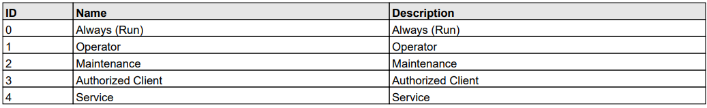
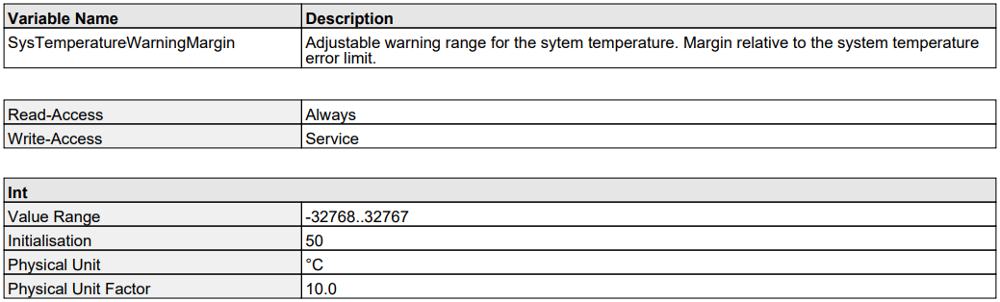
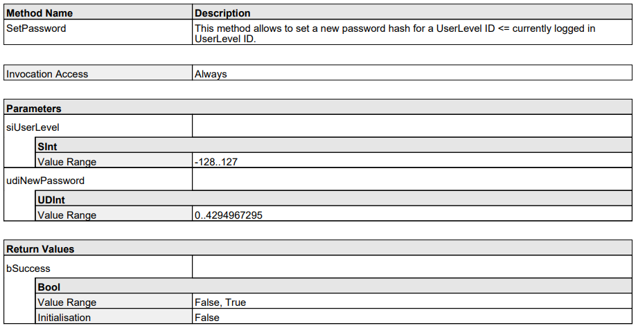
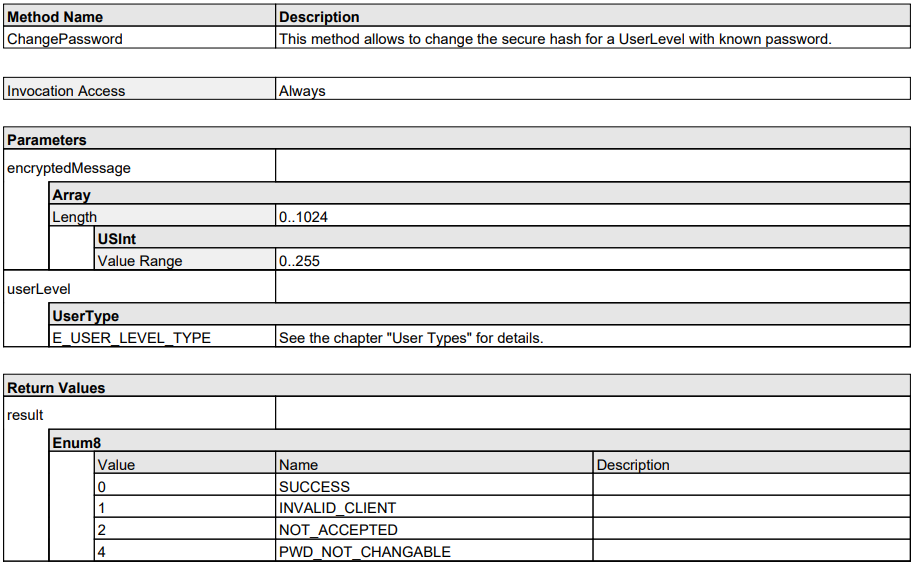

= User level and password configuration
:toclevels: 4
:source-highlighter: rouge
:icons: font
:toc:

This README gives an introduction to the C++ and Python code examples in this folder on how to login/logout to/from a Visionary camera with a certain user level. Further this document describes how change the password for a certain user level.

== How to run the samples

[NOTE]
====
Remember to adjust the command line arguments like IP address (`-i`) and device type (`-d`) to match your specific device.
====

**C++**

:relfileprefix: ../
Either build and run the samples from the top level directory as described in xref:README.adoc#getting-started[Getting Started] or build and run the samples from the sample subdirectory using its CmakeLists.txt file.

**Userlevels**
[source,bash]
----
cd build/
./login_logout -i192.168.1.10 -tVisionary-S
----

**Change password**
[source,bash]
----
cd build/
./password_change -i192.168.1.10 -tVisionary-S
----

**Python**

[NOTE]
====
Make sure you followed the prerequisite steps in xref:README.adoc#getting-started[Getting Started]
====

To run the Python samples, execute the following command from the **top-level directory**:

**Userlevels**
[source,bash]
----
python3 -m userlevels_and_passwords.python.login_logout -i192.168.1.10 -tVisionary-S
----

**Change password**
[source,bash]
----
python3 -m userlevels_and_passwords.python.password_change -i192.168.1.10 -tVisionary-S
----

== User levels: Login and logout

Whether a variable can be written or a method can be executed by a user depends on the required user level. The required user level can be found in the variable overview or the method overview under *Write-Access* and *Invocation Access* respectively. For this it is required to lookup the variable or method definition in the respective xref:HOW_TO_COLA_COMMANDS.adoc#_cola_telegram_listing[telegram listing]. The table below shows all available user levels.

The samples `login_logout.py` and `login_logout.cpp` demonstrate how to login and logout to/from the device with a user level. To showcase how the user level affects the access to the device's variables, the `SysTemperatureWarningMargin` variable is temporarily changed. In addition, the code demonstrates how write access errors can be detected by accessing the variable without suitable access rights.

**Variable definition: SysTemperatureWarningMargin**

Looking at the variable definition we note:

- The *Read-Access* is *Always*
- The *Write-Access* is *Service*
- The data is `Int`
- Physical Unit is *°C*

=== Establish a connection

The first step is to create a camera control object specifing the right `VisionaryType`. 
The `VisionaryControl` class provides an interface for controlling a Visionary Camera, including managing the connection, logging in and out, and controlling data acquisition.

**C++**
[source, c++]
----
include::cpp/login_logout.cpp[tag=control_connection]
----

**Python**
[source, python]
----
include::python/login_logout.py[tag=control_connection]
----

=== Read the current value 

In the next step we read the variable `SysTemperatureWarningMargin` and store its original value. A login is not required since the Read-Access is Always.

**C++**
[source, c++]
----
include::cpp/login_logout.cpp[tag=read_variable]
----

**Python**
[source, python]
----
include::python/login_logout.py[tag=read_variable]
----

=== Write variable without sufficient access rights

After reading the variable we try to set a new value without login. The code demonstrates what would happen if there is an attempt to write a variable which needs *SERVICE access* without any login. It is expected, that a `CoLaError` is reported, namely `VARIABLE_WRITE_ACCESS_DENIED`.

**C++**
[source, c++]
----
include::cpp/login_logout.cpp[tag=write_variable]
----

**Python**
[source, python]
----
include::python/login_logout.py[tag=write_variable]
----

=== Login and write with sufficient access rights

Since writing the variable requires the Userlevel `Service`, we invoke the method `login` of the control object and specify the two arguments, userlevel and password:

==== Userlevel-passwords

[options="header"]
|===
| Userlevel | Password
| Maintenance | MAIN
| Authorized Client | CLIENT
| Service | CUST_SERV
|===

**C++**
[source, c++]
----
include::cpp/login_logout.cpp[tag=login]
----

**Python**
[source, python]
----
include::python/login_logout.py[tag=login]
----

After the login we try to write the variable again. Writing to `SysTemperatureWarningMargin` succeeds.

=== Final Step: Logout and close the connection

Finish by logging out the current user from the device and closing the connection to the device.

**C++**
[source, c++]
----
include::cpp/login_logout.cpp[tag=logout_and_disconnect]
----

**Python**
[source, python]
----
include::python/login_logout.py[tag=logout_and_disconnect]
----

== Changing the password

Changing the password for a given user level requires a few steps which differ based on the *Secure User Level (SUL)* version. We distingush between *SUL 1* for the *Visionary-S CX* and *SUL 2* for the *Visionary-T Mini CX*.  

=== Step 1: Establish a connection

The first step is to create a camera control object specifing the right `VisionaryType`. 
The `VisionaryControl` class provides an interface for controlling a Visionary Camera, including managing the connection, logging in and out, and controlling data acquisition.

**C++**
[source, c++]
----
include::cpp/password_change.cpp[tag=control_connection]
----

**Python**
[source, python]
----
include::python/password_change.py[tag=control_connection]
----

=== Step 2: Login to the user level with the old password

The next step involves signing into the device using the user level for which we wish to modify the password. Alternatively, we can also log in using a user level that possesses superior access rights.

**C++**
[source, c++]
----
include::cpp/password_change.cpp[tag=login_old_password]
----

**Python**
[source, python]
----
include::python/password_change.py[tag=login_old_password]
----

=== Step 3: Change the password

To change the password we call the function `changePasswordForUserLevel` which takes as arguments the `Control-object`, the `old_password`, the `new_password` and the `device_type`. 

If the `device_type`` is *Visionary-S CX* which uses *SUL1*, the function will call the `changePasswordForUserLevelLegacy` and `changePasswordForUserLevelSecure` functions. If the `device_type` is *Visionary-T Mini CX* (*SUL2*) it will only call the `changePasswordForUserLevelSecure`function.

First we change the password. See <<Step 3.1: Invoke the SetPassword CoLa command (SUL1/Visionary-S only)>> and <<Step 3.2: Invoke the ChangePassword CoLa command>> for more details.

**C++**
[source, c++]
----
include::cpp/password_change.cpp[tag=change_password]
----

**Python**
[source, python]
----
include::python/password_change.py[tag=change_password]
----

Now after we changed the password and logged out, we try to login to the `user_level` using the `old_password`. Since we just changed the password this will lead to an error and we won't be able to login.

**C++**
[source, c++]
----
include::cpp/password_change.cpp[tag=wrong_password]
----

**Python**
[source, python]
----
include::python/password_change.py[tag=wrong_password]
----

The login with the `new_password` will succeed.

**C++**
[source, c++]
----
include::cpp/password_change.cpp[tag=new_password_login]
----

**Python**
[source, python]
----
include::python/password_change.py[tag=new_password_login]
----

For safety reasons we reset the password back to the default password.

NOTE: Password changes are permanent. Keep your passwords in a safe place. Otherwise you risk to loose acess to the modified user level.

**C++**
[source, c++]
----
include::cpp/password_change.cpp[tag=reset_password]
----

**Python**
[source, python]
----
include::python/password_change.py[tag=reset_password]
----

=== Step 3.1: Invoke the SetPassword CoLa command (SUL1/Visionary-S only)

The function `changePasswordForUserLevelLegacy` will create and send a CoLa command to invoke the Method `SetPassword`. See the method description below. It takes the user level and the new password as input.

This method call will update the *password hash*.

**C++**
[source, c++]
----
include::cpp/password_change.cpp[tag=set_password_command]
----

**Python**
[source, python]
----
include::python/password_change.py[tag=set_password_command]
----

IMPORTANT: You need to be logged into the required user level to invoke the CoLa command. Login via the `SetAccessMode` or the `login-function` provided by the Python/C++ api.

=== Step 3.2: Invoke the ChangePassword CoLa command 

The function `changePasswordForUserLevelSecure` will create and send a CoLa command to invoke the Method `ChangePassword`. See the method description above.

The CoLa command for the method invocation needs three parameters: 

. the `encryptedMessage` as an array of type `USInt`
. the `length` of the encrypted message array `UInt`
. the `user level` of type `Enum8`

The function completes the following steps to create the `encryptedMessage`:

1. Create the `oldPwStr` 
.. (SUL1) `oldPwStr` = `UserLevelName + ':SICK Sensor:' + oldPassword`.
.. (SUL2) `oldPwStr` = `UserLevelName + ':SICK Sensor:' + oldPassword + ':' + oldSalt`.

2. Create the `newPwStr`
.. (SUL1) `newPwStr` = `UserLevelName + ':SICK Sensor:' + newPassword`.
.. (SUL2) `newPwStr` = `UserLevelName + ':SICK Sensor:' + newPassword + ':' + newSalt`.

NOTE: `UserLevelName` is the string of the name of the desired UserLevel e.g. 'AuthorizedClient'. `oldSalt` is returned by the `GetChallenge CoLa command` in addition to the challenge bytes, `newSalt` is a 16byte random string generated by the client.

3. Calculate `oldPwHash` as `sha256(oldPsStr)`

4. Calculate `newPwHash` as `sha256(newPwStr)`

NOTE: `oldPwHash` and `newPwHash` are a 32x 8bit byte arrays.

5. Calculate `encryptedNewPwdHash` 
    .. (SUL1) encryptedNewPwdHash = `AES128CBC(key, iv, newPwHashPKCS7padded)`
    .. (SUL2) encryptedNewPwdHash = `AES128CBC(key, iv, newPwdHash)`
    
NOTE:  `key` is the first 16 bytes of `oldPwHash` and `iv` is set to be 16 bytes of random data. Set `newPwHashPKCS7padded` to `newPwHash + 16 * "\x10"`. `16 * "\x10"` means 16 times the 0x10 byte thus the `newPwHashPKCS7padded` has a length of 48 bytes in total.

6. Set `hmacData` to `iv + encryptedNewPwdHash`.

7. Calculate `generatedHMAC` as `HMACsha256(oldPwdHash, hmacData)`. `oldPwdHash` is the key for the HMAC.

8. Set `encryptedMessage` to `iv + encryptedNewPwdHash + generatedHMAC`.

**C++**
[source, c++]
----
include::cpp/password_change.cpp[tag=change_password_command]
----

**Python**
[source, python]
----
include::python/password_change.py[tag=change_password_command]
----

=== Final Step: Logout and Close the connection

Finally we disconnect from the control channel and logout from the user level.

**C++**
[source, c++]
----
include::cpp/password_change.cpp[tag=logout_and_close]
----

**Python**
[source, python]
----
include::python/password_change.py[tag=logout_and_close]
----
